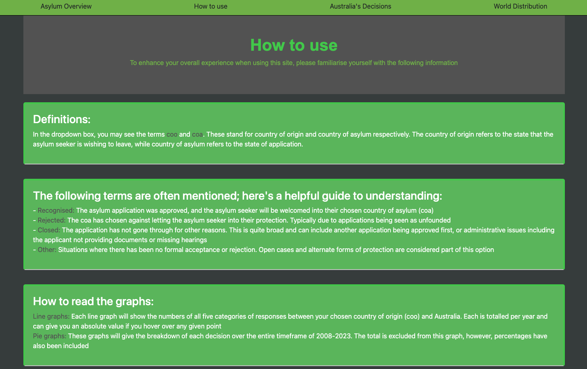
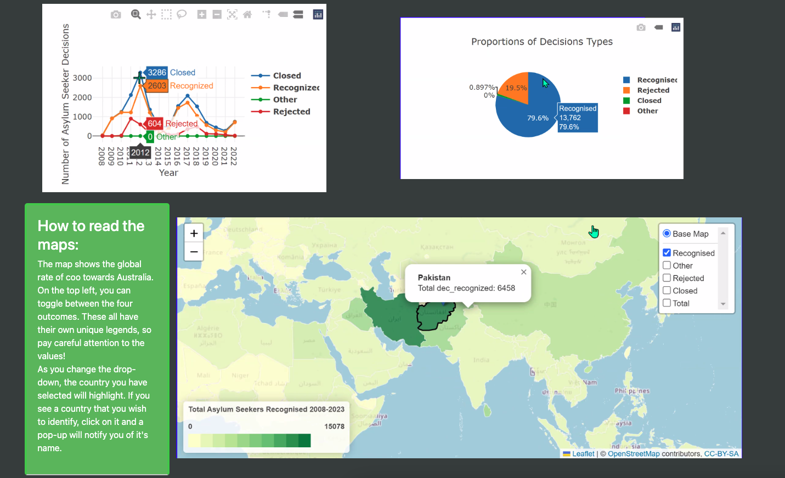

# Project-3-Group-1

## Deployed website
Please click [here](https://wrube.github.io/Project-3-Group-1/) to interact with the website.

## Proposal

A website to allow users to interactively understand and analyse:
- asylum seekers dispcement
  -  internal
  -  external 
- application results
  - positive/negative/   
 

## Instructions on how to use and interact with the project

### How to Interact with the website

### Generate the datasets

Use the file [retrieve_view_data.ipynb](retrieve_view_data.ipynb) to download your own copy.

### Load JSON datasets to Mongo Database
Here we use a local Mongo No-SQL database.

1. Import the asylum-decision JSON dataset to local Mongo database called **project3** using the terminal with:
   
   `mongoimport --type json -d project3 -c asylum_decisions --jsonArray asylum_decisions_2008-2023.json`

2. Import the countries GeoJSON to the same database. To do this successfully, install **jq** and use the following terminal commands:

   `jq --compact-output ".features" countries.geojson > countries_compact.geojson`, then

   `mongoimport --type json -d project3 -c countries countries_compact.geojson`

### Allow Javascript to connect to MongoDB

To allow MongoDB to connect with Javascript, follow the tutorial at [Connect to a MongoDB Database Using Node.js](https://www.mongodb.com/developer/languages/javascript/node-connect-mongodb/).

html product with a map and a couple of graphs

Country of asylum -> dropdown
Country of origin -> html

## Legal considerations made in this project
The source of the data, UNHCR, has outlined that this dataset is licensed under a Creative Commons 4.0. To comply with UNHCR's terms of use, the following has been applied either statically or continually:
- When presenting information, a link to the terms of use shall be present: <https://www.unhcr.org/terms-use-datasets>
- Similarly, accreditation of the original datasource will be shared under the following title: 'UNHCR Refugee Population Statistics Database'
- We will not imply that the UNHCR has approved or endorsed this project in any manner, nor will their logo be shown or tampered with
- There is no mention of the data being restricted by 3rd party contributors for this particular dataset
- Consent is given for API to be used on alternate websites, constituting the freedom to express our project in a HTML
- We accept that UNHCR at any time may discontinue the rights to our project

## Ethical considerations made in this project
1. Personally Identifiable Information (PII)
The original dataset provided by UNHCR does not contain any level of personalised data. Prior to sharing the dataset, the UNHCR aggregated all findings, and so entries only contain the number of findings per standard and not the individuals that represent that finding.
    2. Collection of data
    Come back to this: <https://www.unhcr.org/refugee-statistics/methodology/>
3. Representation
The nature of this dataset suggests that it is a population-wide dataset that represents many different cultures and backgrounds. It is unclear how the factor of socioeconomic factor plays into the dataset, however, the topic of seeking asylum could imply variation within this factor. It is also unclear where the topic of illegal attempts at asylum stand within this datset

### Checklist for Ethically Using Data
2. Investigate how your dataset was collected. Ask yourself questions like the following: Did the people
whose information is represented in the data consent to being included in the dataset? Did they consent
to their information being used in this way? If you can't confirm consent, try finding a different data
source or contacting the people included to obtain informed consent. As you make decisions about your
work, be sure to consider how it may harm or benefit the people in the dataset or their relatives.

### Data protection

Before publishing any statistics on the refugee statistics website, UNHCR applies safeguards to protect confidentiality. Small numbers less than five are rounded to the nearest multiple of five. Additionally data relating to asylum decisions is rounded between five and ten.

Data between tables remains additive therefore the totals should be considered approximations.

## References
- UN [Refugee Statistics](https://api.unhcr.org/docs/refugee-statistics.html#api-Default-countries)

  - Definitions for data
https://www.unhcr.org/refugee-statistics/methodology/data-content/

- Country borders with ISO names from [https://github.com/datasets/geo-countries](https://github.com/datasets/geo-countries) which is a GeoJSON converted dataset sourced from [Natural Earth](https://www.naturalearthdata.com/).

- https://stackoverflow.com/questions/43121679/how-to-append-option-into-select-combo-box-in-d3
- https://blog.debugeverything.com/how-to-use-arrow-functions-with-javascript-filter/
- https://masteringjs.io/tutorials/fundamentals/foreach-object
- https://plotly.com/javascript/bubble-charts/
- https://plotly.com/javascript/time-series/
- https://www.youtube.com/watch?v=5L6h_MrNvsk 
- https://www.youtube.com/watch?v=drkpDLy92uA

  

